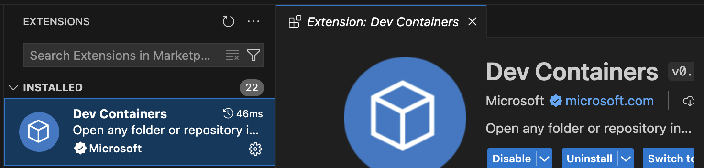
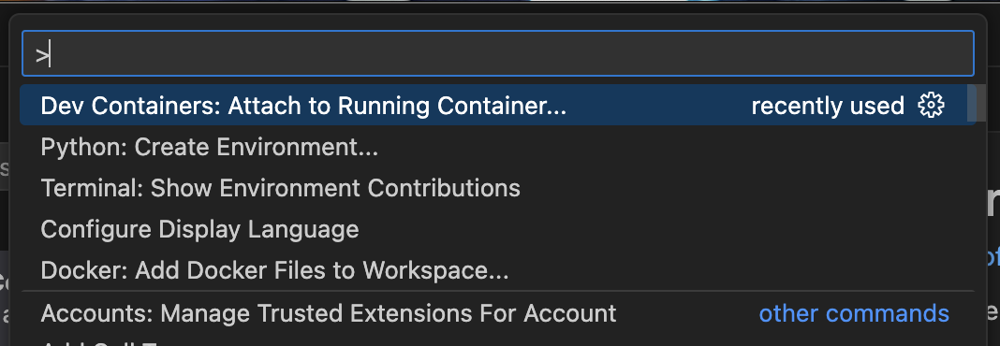

# vscode_docker_test

# 1. 프로젝트 설명
VSCode의 docker container에 원격 접속 기능 테스트를 하기 위한 라이브러리

# 2. 사용법

## 2.1. Docker Desktop 설치
### 2.1.1. Windows
* 참조: https://goddaehee.tistory.com/313

* **Step1: WSL 사용 설정: Windows 기능 활성화**
> Windows 기능 켜기/끄기 --> "Linux용 Windows 하위 시스템"에 체크

* **Step2: PowerShell(관리자권한실행)에서 아래 명령 실행**
```powershell
dism.exe /online /enable-feature /featurename:Microsoft-Windows-Subsystem-Linux /all /norestart
```

```powershell
dism.exe /online /enable-feature /featurename:VirtualMachinePlatform /all /norestart
```

* **Step3: PowerShell(관리자권한실행)에서 WSL 2를 기본 버전으로 설정**
```powershell
wsl --set-default-version 2
```

### 2.1.2. macOS
```zsh
brew install --cask docker
```

## 2.2. github으로부터 'vscode_docker_test' repository clone

```
git clone https://github.com/journeydat/vscode_docker_test.git
```


## 2.3. docker-compose를 통한 컨테이너 실행
```zsh
docker-compose up -d
```

## 2.4. VSCode에서 컨테이너 접속

* **Step1: Extension 설치 (Dev Containers)**

    * ExtensionID: ms-vscode-remote.remote-containers




* **Step2: 명령팔레트 (ctrl + shift + p) 에서 "실행중인 컨테이너에 연결" 선택**



